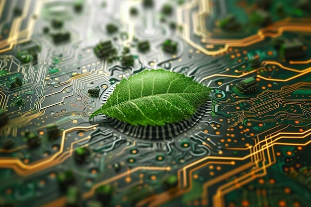

# Informática ecológica

La informática ecológica es un enfoque hacia el uso sostenible de la informática desde el punto de vista medioambiental. Implica fabricar, diseñar, desechar y utilizar ordenadores y recursos relacionados de forma eficaz y eficiente con efectos negativos mínimos o nulos sobre el medio ambiente.

Este enfoque sostenible ayuda a ahorrar electricidad y garantiza que los ordenadores generen menos calor. También ayuda a proteger el medio ambiente de materiales peligrosos y sus impactos.

### Los objetivos de la informática ecológica son:

  1. La eficiencia energética y la gestión de la energía
  2. Utilizar hardware y software respetuosos con el medio ambiente
  3. Minimizar el uso de sustancias peligrosas
  4. Reciclar materiales
  5. Aumentar la vida útil de los productos
